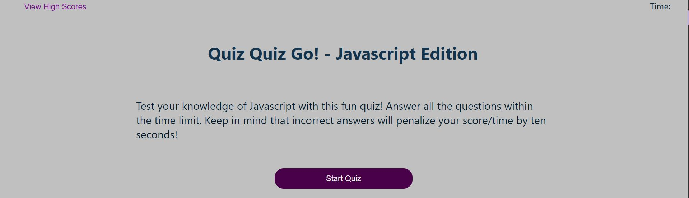

# Quiz Quiz Go - Javascript Knowledge Check!

## Purpose
A small trivia quiz on miscellaneous Javascript facts

## Built With
* HTML
* CSS
* Javascript 

## Website
https://caeldeth.github.io/quiz-quiz-go/  

## Previews

